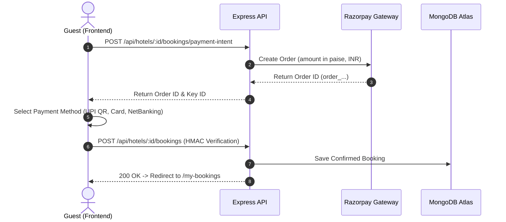

# Roomzy — MERN Full-Stack Hotel Booking & Management Platform

[](https://opensource.org/licenses/MIT)
[](https://www.mongodb.com/)
[](https://expressjs.com/)
[](https://react.dev/)
[](https://nodejs.org/)
[](https://www.typescriptlang.org/)
[](https://vitejs.dev/)
[](https://tailwindcss.com/)
[](https://razorpay.com/)

**Roomzy** is a production-grade, modern **MERN Full-Stack Hotel Booking & Management Platform** tailored with an authentic Indian travel portal experience (MakeMyTrip / Goibibo style). It features seamless **Razorpay payment integration** (supporting **UPI QR & VPA, RuPay, Visa, Mastercard, and Net Banking**), real-time hotel search and filtering, 52+ seeded Varanasi heritage and luxury properties, multi-role access control (Admin, Hotel Owner, Guest), and a comprehensive analytics dashboard.

---

## 🌟 Key Highlights & What Was Built

- **🏨 52 Authentic Varanasi Hotels**: Complete with real ghat locations (*Darbhanga Ghat, Assi Ghat, Godowlia, Cantt, Sarnath*), high-res imagery, star ratings, and pricing in Indian Rupees (₹).
- **💳 Indian Payment Gateway (Razorpay)**:
  - **UPI (Fastest & Zero Fee)**: Instant QR Code scan or enter VPA (`@okhdfcbank`, `@oksbi`, `@paytm`, `@ybl`, etc.).
  - **Cards**: RuPay, Visa, Mastercard with 1-click **Autofill Demo Card** for testing.
  - **Net Banking**: HDFC, SBI, ICICI, Axis, Kotak, and PNB.
  - **Instant Cancellation & Auto-Refunds**: Automated refund lifecycle with MongoDB audit tracking.
- **🎨 Modern Luxury Redesigned UI**:
  - Rebranded to **Roomzy** with a sophisticated **Deep Ruby & Wine Gradient** theme.
  - Responsive, mobile-first design with Tailwind CSS and Lucide icons.
- **👥 1-Click Demo Accounts**:
  - **Guest User**: `guest@user.com` / `12345678`
  - **Hotel Owner**: `owner@hotel.com` / `12345678`
  - **Test Admin**: `test@user.com` / `12345678`

---

## 🏗️ Architecture & Tech Stack

| Layer | Technologies |
|---|---|
| **Frontend** | React 18, TypeScript, Vite, React Router 6, React Query, Tailwind CSS, Lucide React, Sonner |
| **Backend** | Node.js, Express.js, TypeScript, Mongoose (MongoDB ODM), Cookie-Parser, Helmet, Morgan, Compression |
| **Database** | MongoDB Atlas (Cloud Database with TLS encryption) |
| **Payments** | Razorpay SDK (Orders API, HMAC-SHA256 Signature Verification, Refunds) |
| **Media Storage** | Cloudinary (Multi-image upload via Multer) |
| **Authentication** | JWT (HTTP-Only Secure Cookies) + Bcrypt password hashing |

---

## 📁 Repository Structure

```text
├── hotel-booking-backend/       # Express + TypeScript + Mongoose backend
│   ├── src/
│   │   ├── models/             # User, Hotel, Booking, Review, Analytics models
│   │   ├── routes/             # Auth, Users, Hotels, Bookings, My-Hotels, Analytics
│   │   ├── scripts/seed.ts     # Database seeder (52 Varanasi hotels + demo users)
│   │   └── index.ts            # Express server entry point
│   ├── package.json
│   └── .env                    # Backend environment variables
│
├── hotel-booking-frontend/      # React 18 + Vite + Tailwind frontend
│   ├── src/
│   │   ├── components/         # Header, Footer, Hero, SearchBar, BookingCards
│   │   ├── forms/BookingForm/  # MakeMyTrip-style Indian payment & checkout form
│   │   ├── pages/              # Home, Search, Detail, Booking, MyBookings, SignIn
│   │   └── api-client.ts       # Centralized API fetch layer with React Query
│   ├── package.json
│   └── .env.local              # Frontend environment variables
│
└── shared/                      # Shared TypeScript interfaces & types
    └── types.ts
```

---

## ⚙️ Environment Configuration

### 1. Backend (`hotel-booking-backend/.env`)

```env
PORT=5001
NODE_ENV=development
FRONTEND_URL=http://localhost:5174

# Database
MONGODB_CONNECTION_STRING=mongodb+srv://<username>:<password>@cluster0.onnyack.mongodb.net/?retryWrites=true&w=majority&appName=Cluster0

# Security
JWT_SECRET_KEY=your_strong_jwt_secret_key

# Cloudinary (Image Hosting)
CLOUDINARY_CLOUD_NAME=your_cloud_name
CLOUDINARY_API_KEY=your_api_key
CLOUDINARY_API_SECRET=your_api_secret

# Razorpay Payments
RAZORPAY_KEY_ID=rzp_test_your_key_id
RAZORPAY_KEY_SECRET=your_razorpay_secret
```

### 2. Frontend (`hotel-booking-frontend/.env.local`)

```env
VITE_API_BASE_URL=http://localhost:5001
VITE_RAZORPAY_KEY_ID=rzp_test_your_key_id
```

---

## 🚀 Quick Start (Running Locally)

### 1. Clone the Repository
```powershell
git clone https://github.com/kunalmallick734-pixel/Hotel-Booking-Management-System.git
cd Hotel-Booking-Management-System
```

### 2. Install Dependencies
```powershell
# Install backend dependencies
cd hotel-booking-backend
npm install

# Install frontend dependencies
cd ../hotel-booking-frontend
npm install
```

### 3. Seed the Database (52 Varanasi Hotels)
```powershell
cd ../hotel-booking-backend
npm run seed
```

### 4. Start the Application
Open two terminal windows:

**Terminal 1 — Backend:**
```powershell
cd hotel-booking-backend
npm run dev
# Server running at http://localhost:5001
```

**Terminal 2 — Frontend:**
```powershell
cd hotel-booking-frontend
npm run dev
# App running at http://localhost:5174
```

---

## 💳 Payment & Booking Flow



---

## 🛡️ Cancellation & Auto-Refund Lifecycle
- Guests or Admins can cancel upcoming stays from the **My Bookings** dashboard.
- The system calculates eligible refund amounts, executes the Razorpay refund, and transitions status from `confirmed` → `cancelled` and `paid` → `refunded`.

---

## 📄 License
This project is licensed under the [MIT License](LICENSE).
