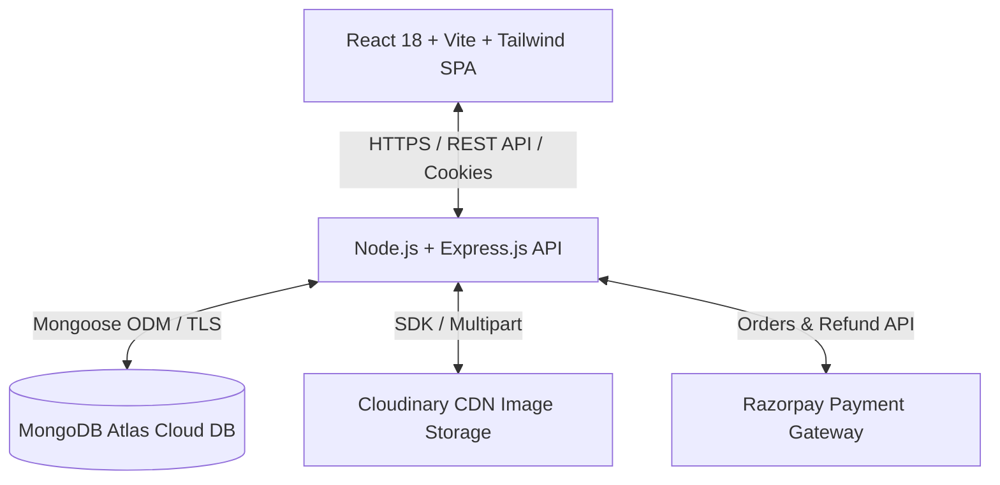
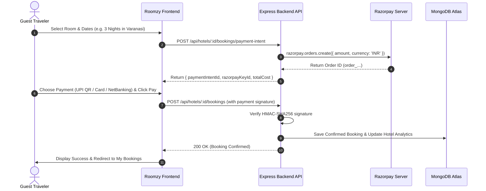

# Roomzy — Modern MERN Full-Stack Hotel Booking & Management Platform

[](https://opensource.org/licenses/MIT)
[](https://www.mongodb.com/)
[](https://expressjs.com/)
[](https://react.dev/)
[](https://nodejs.org/)
[](https://www.typescriptlang.org/)
[](https://vitejs.dev/)
[](https://tailwindcss.com/)
[](https://razorpay.com/)
[](https://cloudinary.com/)

---

## 📖 Introduction

**Roomzy** is an enterprise-grade, modern **MERN Full-Stack Hotel Booking & Hospitality Management Platform** designed to offer a seamless, high-performance booking experience inspired by leading travel portals such as **MakeMyTrip**, **Goibibo**, and **Airbnb**.

Built using **React 18**, **Vite**, **TypeScript**, **Node.js/Express**, and **MongoDB Atlas**, Roomzy features a localized Indian checkout engine powered by **Razorpay** (supporting **UPI QR, UPI ID/VPA, RuPay, Visa, Mastercard, and Net Banking**), 52+ authentic seeded hotels across Varanasi's sacred ghats, multi-role dashboards (Guest, Hotel Owner, Admin), automated refund lifecycles, and a luxury **Deep Ruby & Wine** visual theme.

---

## 📸 Visual Showcase & Screenshots

### 🏨 1. Home, Search & Interactive Filtering
Discover hotels across Varanasi with real-time multi-criteria filtering by star rating, amenities, budget range, and accommodation type.


*Figure 1: Roomzy Landing Page with Hero Search & Value Propositions.*


*Figure 2: Search Results Page with Real-time Filters (Star Rating, Facilities, Price Slider).*

---

### 🛏️ 2. Hotel Details, Room Types & Reviews
Detailed property showcases featuring Cloudinary photo galleries, amenities list, guest ratings, location maps, and interactive booking summary.


*Figure 3: Hotel Overview with Image Gallery, Star Badges, and Per-Night Rates.*


*Figure 4: Verified Guest Reviews and Property Policies.*

---

### 💳 3. Indian Travel Checkout & Payment System (MakeMyTrip Style)
Comprehensive checkout with **UPI QR Scanner**, **UPI VPA Autofill**, **RuPay/Cards**, **Net Banking Grid**, and promo coupon code savings.


*Figure 5: MakeMyTrip-style Payment Selector with Instant UPI QR, Autofill Demo Card, and GST breakdown.*

---

### 📊 4. Role-Based Dashboards & Analytics
Multi-tier portal tailored for Guests (My Bookings & Cancellations), Hotel Owners (Property & Inventory Management), and Administrators (Revenue & Booking Analytics).


*Figure 6: Guest Bookings Management with 1-click Cancellations and Automated Refunds.*


*Figure 7: Hotel Owner Portal for Creating, Editing, and Managing Listed Properties.*


*Figure 8: Business Analytics Dashboard showing Revenue, Total Bookings, and Conversion Rates.*


*Figure 9: Detailed Breakdown by Booking Status, Payment Methods, and Property Types.*

---

### 🔐 5. 1-Click Demo Authentication & Swagger API
Seamless onboarding with 1-click test logins and interactive OpenAPI/Swagger backend documentation.


*Figure 10: Sign In Page featuring 1-click Test Admin, Hotel Owner, and Guest User Accounts.*


*Figure 11: Interactive Swagger API Documentation Explorer at `/api/docs`.*

---

## 📑 Table of Contents

- [Features Breakdown](#-features-breakdown)
- [Tech Stack & Architecture](#-tech-stack--architecture)
- [Monorepo Structure](#-monorepo-structure)
- [Database & Seed Data (52 Varanasi Hotels)](#-database--seed-data-52-varanasi-hotels)
- [Payment & Booking Engine](#-payment--booking-engine)
- [Environment Variables (.env)](#-environment-variables-env)
- [Step-by-Step Local Setup](#-step-by-step-local-setup)
- [API Reference](#-api-reference)
- [Demo User Accounts](#-demo-user-accounts)
- [Security & Compliance](#-security--compliance)
- [License](#-license)

---

## 🚀 Features Breakdown

### 1. For Guests (Travelers)
- **Smart Search & Filters**: Search by destination, dates, adults/children, star rating (1–5 stars), price range (₹1,000–₹25,000+), hotel types (*Heritage, Riverside, Luxury, Boutique, Budget, Resort*), and amenities (*Free WiFi, Swimming Pool, Ganga View, Pure Veg Dining, Spa*).
- **MakeMyTrip-Style Checkout**:
  - **UPI Mode**: Scan QR code directly via GPay / PhonePe / Paytm / BHIM / CRED or input UPI VPA (`@okhdfcbank`, `@oksbi`, etc.).
  - **Card Payment**: RuPay, Visa, Mastercard, and Amex with 1-click **Autofill Test Card**.
  - **Net Banking**: Direct bank select grid for HDFC, SBI, ICICI, Axis, Kotak, and PNB.
  - **Promo Codes**: Built-in `HOLIDAYINDIA` coupon for instant discounts.
- **My Bookings & Instant Refunds**: View confirmed stays, download receipts, and cancel bookings with automated instant refund status updates.

### 2. For Hotel Owners
- **Property Management**: Multi-step hotel creation form with validation for name, description, address, city, country, pricing per night, star rating, and amenities.
- **Cloudinary Image Upload**: Drag-and-drop support for up to 6 high-resolution property photos.
- **Live Inventory & Booking Logs**: Track revenue, guest lists, and reservation dates for every listed property.

### 3. For Platform Administrators
- **Executive Analytics Dashboard**: Real-time business metrics including Total Revenue, Average Booking Value, Conversion Rate, Cancellation Rate, and Total Users.
- **Visual Analytics**: Interactive charts breaking down bookings by status (`confirmed`, `pending`, `cancelled`, `refunded`), payment method (`upi`, `card`, `netbanking`), and hotel type.
- **Platform-Wide Governance**: Full oversight to view, edit, or cancel any booking across all hotels.

---

## 🛠️ Tech Stack & Architecture



### Stack Components

| Layer | Technologies Used |
|---|---|
| **Frontend UI** | React 18, Vite 7, TypeScript, React Router DOM 6, React Query (TanStack Query), Tailwind CSS, Lucide React, React Hook Form, Sonner |
| **Backend API** | Node.js (v18+), Express.js, TypeScript, Mongoose ODM, Cookie-Parser, Helmet, Compression, Morgan, Express-Rate-Limit |
| **Database** | MongoDB Atlas (Multi-collection document store with TLS/SSL encryption) |
| **Payments** | Razorpay SDK (Orders API, Webhooks, HMAC-SHA256 signature verification, Refund API) |
| **Media Storage** | Cloudinary API (via Multer middleware for buffer streaming) |
| **Authentication** | JSON Web Tokens (JWT) stored in HTTP-Only secure cookies + Bcrypt.js password hashing |
| **Documentation** | Swagger UI Express + OpenAPI Specifications |

---

## 📂 Monorepo Structure

```text
Hotel-Booking-Management-System/
├── hotel-booking-backend/           # Express + TypeScript REST API
│   ├── src/
│   │   ├── middleware/              # Auth verification, validation middleware
│   │   ├── models/                  # User, Hotel, Booking, Review, Analytics Mongoose models
│   │   ├── routes/                  # API routes (auth, users, hotels, my-hotels, bookings, analytics)
│   │   ├── scripts/seed.ts          # Database seeder (52 Varanasi hotels + demo users + analytics)
│   │   ├── swagger.ts               # OpenAPI / Swagger API configuration
│   │   └── index.ts                 # Express server bootstrap & MongoDB connection
│   ├── package.json
│   ├── tsconfig.json
│   └── .env                         # Backend environment variables
│
├── hotel-booking-frontend/          # React 18 + Vite SPA Frontend
│   ├── src/
│   │   ├── components/              # Header, Footer, Hero, SearchBar, Pagination, Filters, Cards
│   │   ├── contexts/                # AppContext (Auth state, Toast notifications, Razorpay Key)
│   │   ├── forms/BookingForm/       # Indian Checkout Form (UPI QR, Card, Net Banking)
│   │   ├── forms/ManageHotelForm/   # Hotel owner creation/edit multi-step form
│   │   ├── pages/                   # Home, Search, Detail, Booking, MyBookings, Analytics, SignIn
│   │   ├── api-client.ts            # Centralized Axios/Fetch API layer
│   │   └── index.css                # Tailwind CSS root & custom theme tokens
│   ├── index.html                   # HTML entry point (Preloaded Inter font + Razorpay CDN)
│   ├── tailwind.config.js           # Tailwind theme configuration
│   ├── package.json
│   └── .env.local                   # Frontend environment variables
│
├── shared/                          # Shared TypeScript Contracts
│   └── types.ts                     # Single source of truth for User, Hotel, Booking, & Payment types
│
└── docs/                            # Deep-dive architecture and design walkthroughs
```

---

## 🕉️ Database & Seed Data (52 Varanasi Hotels)

The database comes pre-seeded with **52 authentic hotels based in Varanasi, India**, covering the holy ghats, luxury cantonment estates, and historic Buddhist circuits:

| Category | Example Properties | Location / Ghat | Starting Price |
|---|---|---|---|
| **Heritage Palaces** | BrijRama Palace, Amritara Suryauday Haveli, Hotel Surya Kaiser Palace | Darbhanga Ghat, Shivala Ghat | ₹4,800 – ₹16,500 |
| **5-Star Luxury Resorts** | Taj Ganges Varanasi, Radisson Hotel, Ramada Plaza by Wyndham, Tree of Life Resort | Cantonment, Seer Goverdhanpur | ₹7,500 – ₹12,800 |
| **Riverside Boutique** | Hotel Ganga View & Suites, Palace on Ganges, Scindhia Guest House, Hotel Alka | Assi Ghat, Mir Ghat, Tulsi Ghat | ₹1,800 – ₹5,100 |
| **Temple & Pilgrimage** | Kashi Vishwanath Residency, Ganges Grand, Hotel Swarn Ganga, Hotel Swarna Kashi | Godowlia, Dashashwamedh | ₹2,100 – ₹4,100 |
| **Hostels & Budget Stays** | Zostel Varanasi, GoStops Varanasi, Hotel Temple on Ganges, Hotel City Inn | Luxa Road, Assi Ghat, Cantt | ₹1,450 – ₹2,200 |
| **Sarnath & Peace Retreats**| Gautam Buddha Resort, Sarnath Peace Pagoda Retreat & Spa | Sarnath Stupa Area | ₹3,600 – ₹3,800 |

---

## 💳 Payment & Booking Engine



---

## ⚙️ Environment Variables (.env)

### 1. Backend (`hotel-booking-backend/.env`)
Create a `.env` file in `hotel-booking-backend/`:

```env
# Server
PORT=5001
NODE_ENV=development
FRONTEND_URL=http://localhost:5174

# Database (MongoDB Atlas)
MONGODB_CONNECTION_STRING=mongodb+srv://<username>:<password>@cluster0.onnyack.mongodb.net/?retryWrites=true&w=majority&appName=Cluster0

# Authentication
JWT_SECRET_KEY=your_super_secret_jwt_key_here

# Cloudinary Image Hosting
CLOUDINARY_CLOUD_NAME=your_cloudinary_cloud_name
CLOUDINARY_API_KEY=your_cloudinary_api_key
CLOUDINARY_API_SECRET=your_cloudinary_api_secret

# Razorpay Payment Gateway (Test or Live)
RAZORPAY_KEY_ID=rzp_test_your_key_id
RAZORPAY_KEY_SECRET=your_razorpay_secret
```

### 2. Frontend (`hotel-booking-frontend/.env.local`)
Create a `.env.local` file in `hotel-booking-frontend/`:

```env
VITE_API_BASE_URL=http://localhost:5001
VITE_RAZORPAY_KEY_ID=rzp_test_your_key_id
```

---

## 🚀 Step-by-Step Local Setup

### 1. Prerequisites
- **Node.js** (v18 or v20 LTS)
- **Git**
- **MongoDB Atlas** database connection string

### 2. Clone the Repository
```powershell
git clone https://github.com/kunalmallick734-pixel/Hotel-Booking-Management-System.git
cd Hotel-Booking-Management-System
```

### 3. Install Backend Dependencies
```powershell
cd hotel-booking-backend
npm install
```

### 4. Install Frontend Dependencies
```powershell
cd ../hotel-booking-frontend
npm install
```

### 5. Seed the Database
Populate your MongoDB database with the 52 Varanasi hotels, demo users, sample reviews, and analytics snapshots:
```powershell
cd ../hotel-booking-backend
npm run seed
```

### 6. Run the Dev Servers
Open two separate terminal windows:

**Terminal 1 — Backend (Port 5001):**
```powershell
cd hotel-booking-backend
npm run dev
```

**Terminal 2 — Frontend (Port 5174):**
```powershell
cd hotel-booking-frontend
npm run dev
```

Open your browser and visit: 👉 **`http://localhost:5174`**

---

## 📡 API Reference

Interactive Swagger documentation is available at **`http://localhost:5001/api/docs`**.

### Core Endpoints

| Method | Endpoint | Access | Description |
|---|---|---|---|
| `POST` | `/api/auth/login` | Public | Sign in user & set HTTP-only JWT cookie |
| `POST` | `/api/auth/logout` | Public | Clear JWT session cookie |
| `GET` | `/api/auth/validate-token` | Private | Verify user session status |
| `GET` | `/api/users/me` | Private | Fetch logged-in user profile |
| `GET` | `/api/hotels/search` | Public | Search hotels with multi-criteria filters & pagination |
| `GET` | `/api/hotels/:id` | Public | Get hotel details by ID |
| `POST` | `/api/hotels/:id/bookings/payment-intent` | Private | Create Razorpay order intent for booking |
| `POST` | `/api/hotels/:id/bookings` | Private | Verify payment signature and confirm room booking |
| `GET` | `/api/my-bookings` | Private | Get bookings for logged-in user |
| `POST` | `/api/bookings/:id/cancel` | Private | Cancel upcoming booking and trigger refund |
| `GET` | `/api/my-hotels` | Hotel Owner | Get properties owned by logged-in user |
| `POST` | `/api/my-hotels` | Hotel Owner | Create a new hotel with Cloudinary image upload |
| `GET` | `/api/analytics` | Admin | Get aggregated business and revenue metrics |
| `GET` | `/api/health` | Public | Server and MongoDB database health check |

---

## 👥 Demo User Accounts

You can use the 1-click login buttons on the **Sign In** page or use the credentials below:

| Role | Email | Password | Permissions |
|---|---|---|---|
| **Guest User** | `guest@user.com` | `12345678` | Search hotels, book rooms, manage personal bookings, cancel & refund |
| **Hotel Owner** | `owner@hotel.com` | `12345678` | Manage hotels, upload photos, inspect room bookings & property revenue |
| **Platform Admin**| `test@user.com` | `12345678` | Full admin analytics dashboard, manage all hotels & platform reservations |

---

## 🔒 Security & Compliance

- **HTTP-Only Cookies**: JWT tokens are stored in `HttpOnly`, `SameSite=Lax`, `Secure` cookies preventing XSS token theft.
- **HMAC Signature Verification**: Every Razorpay payment is validated cryptographically server-side using `crypto.createHmac('sha256')` before confirming a booking.
- **Helmet & Rate Limiting**: HTTP headers hardened against clickjacking/XSS, with rate limiting applied to authentication endpoints.
- **Input Sanitization & Type Safety**: Strict TypeScript interfaces enforced across both frontend and backend via `shared/types.ts`.

---

## 📄 License

This project is licensed under the **MIT License** — see the [LICENSE](LICENSE) file for details.

---

### ⭐ Built with Passion for Modern Full-Stack Web Development!
If you find this project helpful, feel free to **Star** the repository on [GitHub](https://github.com/kunalmallick734-pixel/Hotel-Booking-Management-System)!
